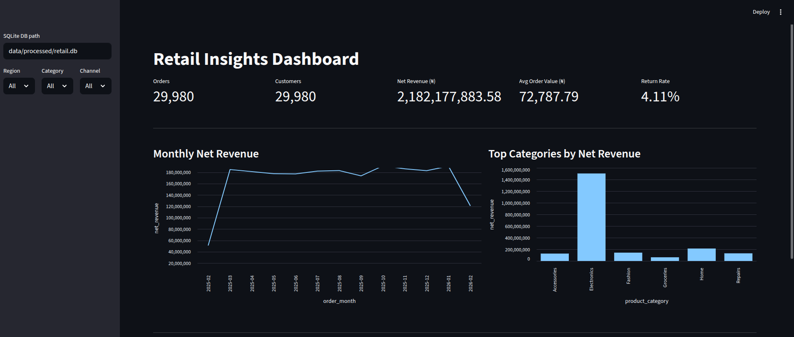
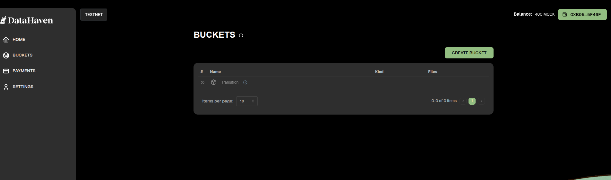

## 📊 Project Showcase

### Interactive Dashboard

### Automated KPI Report

### What I Learned
- Built a complete ETL pipeline from raw CSV to database and dashboard
- Improved data validation and cleaning using Pandas
- Automated reporting with Python and SQLite
- Used GitHub Actions for continuous integration

### How to Run
- Clone the repository
- Create a virtual environment
- Install dependencies from `requirements.txt`
- Run the data pipeline scripts
- Launch the Streamlit dashboard

### Key Insights
- Online channel generates the highest revenue
- Electronics products have higher return rates
- Lagos region contributes the largest share of sales
- Discounts significantly affect net revenue
